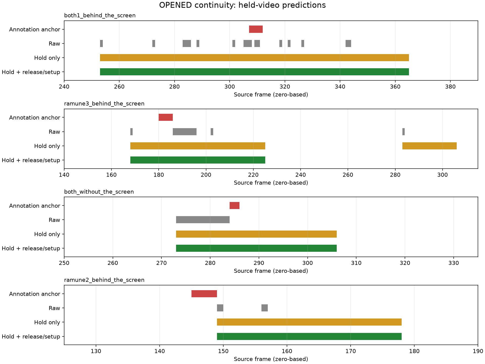

# 0924 ラムネOPENEDの表示保持・再発火抑制実験

**追試で採否を更新：[再許可・連続試行の追試](0924-opening-rearm.md)。**
この文書の手首可視性を必須にした候補は、連結テストで2回目を抑制したため採用保留です。

2026-09-24。現ブランチで実施。本番コード、元注釈、元の学習器の方式は変更していない。

## 結論

**0.75秒の表示保持＋手の離れによる解除＋0.15秒の準備確認**を次の試作候補とする。幕越しの注釈に対応した表示後の再出現は5回→0回、注釈を含む判定は3/7→5/7。初回も準備を要求すると、幕なしの未対応出力は6区間→0区間となり、注釈を含む判定は0/2→1/2になった。

ここでの成功は「注釈OPENED区間と表示が重なること」。物理的な開栓、通知時刻の正確さ、Unityへの実通知を測った結果ではない。ユーザー指定に従い、注釈を含む連続表示の前後への伸長は誤りにしない。

## 比較結果

### 幕越し12動画・開栓注釈7区間

| 方式 | 注釈との重なり | 全OPENED区間数 | 対応後の再出現 | 未対応区間数 | 区間F1 |
| --- | ---: | ---: | ---: | ---: | ---: |
| 加工なし | 3/7 | 22 | 5 | 14 | 0.207 |
| 表示保持のみ | 5/7 | 7 | 1 | 1 | 0.714 |
| 保持・解除を同時選択 | 4/7 | 7 | 1 | 2 | 0.571 |
| 同じ保持＋動作分類で解除 | 5/7 | 7 | 1 | 1 | 0.714 |
| 同じ保持＋手の離れで解除 | 5/7 | 6 | 0 | 1 | 0.769 |
| 手の離れで解除＋初回も準備必須 | 5/7 | 6 | 0 | 1 | 0.769 |

### 幕なし4動画・開栓注釈2区間

| 方式 | 注釈との重なり | 全OPENED区間数 | 対応後の再出現 | 未対応区間数 | 区間F1 |
| --- | ---: | ---: | ---: | ---: | ---: |
| 加工なし | 0/2 | 6 | 0 | 6 | 0.000 |
| 表示保持のみ | 1/2 | 5 | 0 | 4 | 0.286 |
| 保持・解除を同時選択 | 1/2 | 4 | 0 | 3 | 0.333 |
| 同じ保持＋動作分類で解除 | 1/2 | 4 | 0 | 3 | 0.333 |
| 同じ保持＋手の離れで解除 | 1/2 | 4 | 0 | 3 | 0.333 |
| 手の離れで解除＋初回も準備必須 | 1/2 | 1 | 0 | 0 | 0.667 |

区間F1 = 2 × 注釈と対応した区間数 /（注釈区間数＋予測OPENED区間数）。1本の連続出力を2回の開栓として数えず、余分な分断・未対応区間を減点する。注釈区間から1フレーム外れた出力も、現集計では未対応。

## 選ばれた条件の動作

1. 初回は、学習器のactionがRAMUNEかつphaseがFORMINGまたはREADYの状態を0.15秒継続してから待機状態に入る。
2. phaseがOPENEDになれば表示開始し、オフラインの通知パルスを1回生成する。
3. OPENEDが途切れても最後のOPENEDから0.75秒は表示を保持する。OPENEDが続く限り、この時間で強制終了しない。過去のフレームへ遡って表示を付け足す処理も行わない。
4. 保持が終了したら再発火を抑制する。骨格欠落やタイムアウトだけでは再許可しない。
5. actionがRAMUNE以外で、両肩・両手首が見え、左右手首の横方向の距離が肩幅の0.8倍を超える状態を0.3秒継続したら解除確認とする。
6. 続いて再度0.15秒の準備を確認してから次のOPENEDを受け付ける。

0.75秒と0.3秒は各外側分割の学習側だけで選んだ結果、全分割で一致した。準備0.15秒と手の離れ0.8肩幅は固定した試作条件。実行時の判定は予測action・phaseと骨格だけを使い、注釈の開始・終了は使わない。

## 動画ごとの確認

- **both1（幕越し）**：11個に分断されていた表示が1本になり、注釈後の5回の再出現を解消。
- **ramune3（幕越し）**：保持だけでは後半の再出現が1回残った。手の離れを解除条件に加えると、この再出現を抑制。
- **both2（幕越し）**：元のphase推論がOPENEDを出していない。保持・再発火抑制だけでは改善しない。
- **ramune2（幕越し）**：注釈145–148フレームに対して出力は149フレームから。1フレーム遅れなので厳密な重なり判定では未対応。未来の出力を過去に移して補正してはいない。
- **ramune（幕なし）**：元の出力が注釈の開栓付近を捉えておらず、準備必須条件ではOPENEDなし。未検出が残る。
- **contrast・yusuzumi（幕なし）**：冒頭などの短いOPENEDを、初回の準備確認で抑制。



赤は元の短いOPENED注釈、灰は加工なし、黄は保持のみ、緑は準備確認と手の離れによる再発火抑制を含む条件。横軸は動画の0始まりフレーム番号。

## 比較方法と限界

- 入力は中央マスク継続・人物選択なしの既存骨格キャッシュ。16動画を再利用し、新たな姿勢モデルの推論条件は変更しない。
- 外側は幕越しtake 1/2/3で分割。各分割の学習8動画だけでaction・phase学習器の設定を選び、内側の動画分割で作った予測から表示保持・解除条件を選ぶ。外側評価動画は学習・条件選択に入れない。
- 内側予測の基礎学習器の設定は、同じ外側学習集合で選んだものに固定する。内側成績は条件選択用であり、報告値は外側予測。
- 幕なし4動画は条件選択・学習に使わず、幕越し12動画で選択・学習したモデルを適用する。
- 加工なしの外側予測も同じ手順で作り直し、以前の保存済みOPENED予測と一致することを確認。別の外側分割の予測を、現在の分割の内側検証に流用しない。
- 保持候補は0.1 / 0.25 / 0.5 / 0.75秒、解除候補は0.3 / 0.6秒。区間F1、対応数、action外表示時間の短さ、保持の短さの順で選ぶ。action外の時間は同点時の選択にのみ使い、連続伸長自体を不正解とは扱わない。
- 最初に保持・解除を同時選択した条件では、both1の初回の短い出力でロックされ、後続の本来の出力まで抑制した。保持時間を保持単独の選択結果にそろえ、解除方法と初回準備条件を追加比較した。
- 方式追加は結果を確認しながら行った探索。外側分割を保っていても、方式全体に対する完全未使用の評価セットではない。
- 実動画に同一人物が連続して2回開栓する正例がなく、「次の正当な試行を妨げない」ことは合成入力のテストでのみ確認。次は開栓→手を離す→再準備→再開栓の動画が必要。
- 動画末尾で状態をリセットするオフライン実験。実カメラの不規則な入力間隔・長い欠落・人物交代や、Unityとの通信は未検証。

表示保持は誤った一瞬の出力も延ばす。候補方式のaction外表示は幕越し計2.73秒、幕なし計0.50秒で、連続した正しい伸長も含む監査用の数値である。表示区間と通知パルスは別に保存・集計したが、現方式では1連続表示につき1パルスなので件数は一致する。

## 再現・検証

gesture_detectionディレクトリで：

```bash
uv sync
OPENBLAS_NUM_THREADS=1 MPLCONFIGDIR=/tmp/suzukaze-matplotlib \
  uv run python -m scripts.evaluate_opening_temporal --plot
uv run pytest tests/test_evaluate_opening_temporal.py tests/test_evaluate_timeline.py --no-cov -q
uv run python -m compileall src scripts/evaluate_opening_temporal.py
```

後処理の11テストと既存のtimeline評価10テスト、計21テストで、因果性、長い連続表示、再発火抑制、正当な2回目の開栓、骨格欠落時の再許可防止、学習・評価の分離を確認。ruff・構文検査も実施。

生データ：[条件選択・動画別成績](0924-opening-temporal-results.json)。フレーム予測はshared/results/0924-cache/0924-opening-temporal-results-predictions.npz。
