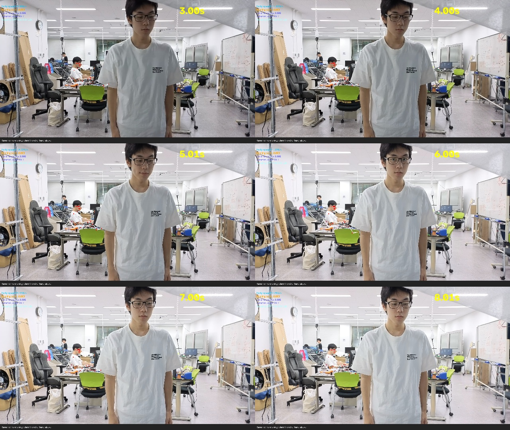
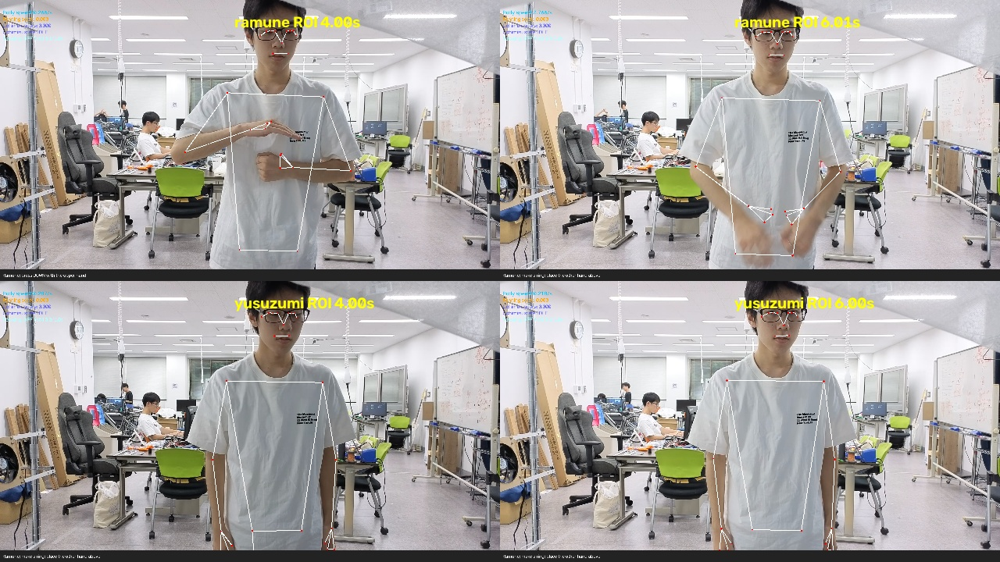

# 明るい環境の幕なし対照（2026-09-23）

## 対象と評価範囲

`shared/videos/bright-without-the-screen` の `aogi.mp4`、`ramune.mp4`、
`uchimizu.mp4`、`yusuzumi.mp4` を各1本評価した。
MediaPipe Pose Lite、VIDEO、confidence 0.5、30 FPSの固定時間格子で、
前回の明るい幕越し評価と同じ判定器を使用した。

動画に正解動作区間が付いていないため、入退場を含む全編の診断である。
検出の有無は報告できるが、動作区間内の再現率・区間外の誤発火率・関節PCKは未算出。
全編の姿勢取得率には背景人物も含まれ、実演者を正しく追跡できた割合ではない。

## 無加工での結果

| 動作 | 全編で当該動作を検出 | 最初の出力時刻 | 出力フレーム数 |
| --- | --- | ---: | ---: |
| 扇ぎ | あり | 4.31秒 | 32 |
| ラムネ | なし | — | 0 |
| 打ち水 | あり | 3.21秒 | 11 |
| 夕涼み | なし | — | 0 |

打ち水動画では扇ぎも11フレーム出力した。正解区間未確定のため、ここでは誤発火率には換算しない。
今回もラムネ・夕涼みが成立しなかったが、幕なしであることだけで姿勢入力が正しいとは言えなかった。

## 背景人物への追跡固定

骨格を元映像へ重ねて確認すると、夕涼みは実演者が中央に立った後も
左奥の着席人物を追跡し続けていた（3〜8秒の確認画像）。
ラムネも3〜4秒では背景人物に骨格が付き、5秒以降に実演者へ切り替わった。



単一人物のVIDEO追跡が先に見つけた背景人物を保持していることが、今回の主要な入力問題。
全編の姿勢取得率99〜100%を「実演者の検出成功」と解釈してはいけない。
夕涼みの速度統計も背景人物の動きを含み、実演者の静止判定の診断にはそのまま使えない。

## 実演領域に限定した診断

この4本専用の診断として、横位置36〜82%以外を灰色に置換し、元の画像サイズと座標系を維持した。
これは背景人物を除いた場合の比較であり、本番カメラへの固定設定ではない。
画面端の腕も切れるため、全動作に適した領域とは限らない。

| 動作 | 領域限定後の当該出力フレーム数 | 初回時刻 |
| --- | ---: | ---: |
| 扇ぎ | 4 | 6.38秒 |
| ラムネ | 0 | — |
| 打ち水 | 14 | 3.21秒 |
| 夕涼み | 0 | — |

4秒・6秒の画像では、ラムネ・夕涼みとも実演者に骨格が付くことを確認した。



ラムネはREADYが72フレーム。READY状態で観測した押下量最大は0.470肩幅だが、
手首間隔の縮小量最大は0.215で条件0.25に届かない。
元画像のREADY中は押下量最大0.108、縮小量最大0.089だった。
これらはREADYに留まったフレームの診断値で、状態リセットされた瞬間を含む全動作の最大変位ではない。
掌の接触とPoseの手首間隔は異なるため、開栓条件の表現自体にも検討が必要。

夕涼みは領域限定後も静止扱いの最長が0.267秒で、必要な1秒を維持できない。
全編の速度中央値は0.347（上限0.30）だが入退場も含むため、静止区間の速度とは区別する。
単純な領域限定で扇ぎの出力が32→4フレームへ減ったことからも、この固定領域を本番へそのまま導入しない。

## 今回分かったことと次の修正対象

1. 幕なしにも背景人物の追跡固定がある。実演エリア指定または複数人物からの選択・再取得を先に整える。
2. 実演者を捉えてもラムネと夕涼みは未成立。人物選択を安定させた入力で、
   ラムネの押下表現・夕涼みの可視点変動と推定揺れを検証する。
3. 各1本なので、これだけで閾値を最適化したり幕ありとの差を一般化しない。
   正解区間が確認できれば区間内検出と区間外出力を再集計できる。

今回の追加は評価スクリプト・レポートのみで、所作判定の本番条件は変更していない。
前回の表示平滑化はこの人物選択の問題を解決しない。

## 再現

```bash
uv sync
POSE_SELECT_SUBJECT=false uv run python -m scripts.evaluate_unlabelled_controls \
  --videos shared/videos/bright-without-the-screen \
  --output docs/bright-without-controls.json
POSE_SELECT_SUBJECT=false uv run python -m scripts.evaluate_unlabelled_controls \
  --videos shared/videos/bright-without-the-screen \
  --preprocess control_roi --output docs/bright-without-roi.json
```

[無加工の数値](bright-without-controls.json)・[領域限定の数値](bright-without-roi.json)。
各動画のSHA-256も記録した。評価処理の既存テスト13件、Ruff、構文チェックを実施。
