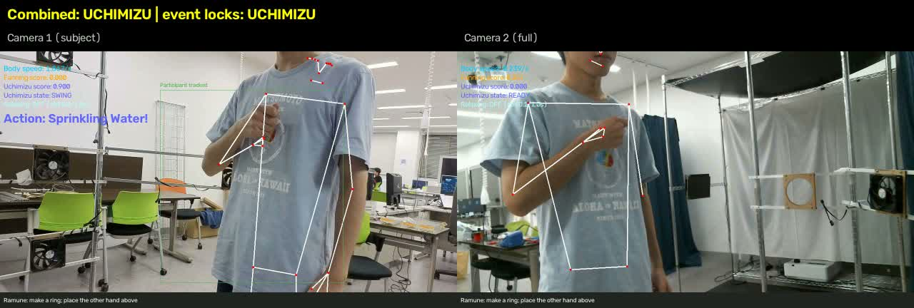

# 2カメラで所作を認識する

`gesture-detection`から、2カメラの認識結果を統合して利用できます。
[0928の検証候補](0928-multicam-handoff.md)を、アプリ本体の選択式プロファイルへ移植しています。

## 実カメラ

`.env`を次のように設定して起動します。

```dotenv
MULTICAM_ENABLED=true
MULTICAM_CAMERA_INDICES=1,2
MULTICAM_FIRST_SELECT_SUBJECT=true
MULTICAM_SECOND_SELECT_SUBJECT=false
MULTICAM_VIDEO_SESSION=
VIDEO_SOURCE=
POSE_RUNNING_MODE=VIDEO
RAMUNE_DETECTOR=rules
MULTICAM_HEADLESS=false
```

```bash
uv sync --group dev
uv run gesture-detection
```

`MULTICAM_CAMERA_INDICES`は実際のPCのデバイスIDに合わせます。
**並び順が役割を決めます**。最初のIDは人物選択あり、2番目のIDは全画面解析です。
0928では最初が左側のInsta360 Link 2C、2番目が右側のLogicool HD Webcam C615でした。
両カメラが同じ実演者を撮影する構成で利用します。

各カメラは別プロセスで取得・推論します。片方のフレーム取得を待ってもう片方を止めず、
同じPCの単調時計で取得時刻を記録します。要求する解像度は
`MULTICAM_WIDTH` / `MULTICAM_HEIGHT`（既定1280×720）、要求FPSは`FPS`です。
設定されたFPSで撮れなくても、動作判定は実際の取得時刻で進めます。
時刻はフレームを読み終えた時点のもので、両カメラの露光を同期するハードウェア同期ではありません。

ウィンドウの左右はカメラ別の診断、上部の**Combined**は統合結果です。
古い入力は`stale`と表示します。`Esc`またはウィンドウを閉じて終了します。
`MULTICAM_HEADLESS=true`では画面を出さず、`Ctrl+C`で終了します。
カメラの切断や推論プロセスの異常はエラーとして通知し、両方の入力を終了します。



ラムネの成功・解除待ちガイドは共有状態を反映します。
解除が必要な間は、上の手を下げるか両手を離すよう案内します。

## 録画セッションで再生する

Desert-sabaku/multicam-recorderの`session.json`を指定できます。
`duration_seconds`と、各カメラの`camera_index`・`file`・`frames_written`・`width`・`height`を使用します。

```dotenv
MULTICAM_ENABLED=true
MULTICAM_CAMERA_INDICES=1,2
MULTICAM_VIDEO_SESSION=shared/videos/0928/20260928_001754/session.json
VIDEO_SOURCE=
POSE_RUNNING_MODE=VIDEO
RAMUNE_DETECTOR=rules
VIDEO_OUTPUT_PATH=output/001754-multicam.mp4
MULTICAM_TRACE_PATH=output/001754-multicam.jsonl
MULTICAM_HEADLESS=true
```

同じ`uv run gesture-detection`で、左右比較と統合結果を含むMP4を出力します。
録画再生ではUnityへ通知しません。`MULTICAM_TRACE_PATH`を指定すると、
各融合時刻の結果と各カメラの最終結果をJSONLで保存します。
出力先に元動画・セッション情報や同じ出力ファイルを指定するとエラーになります。

この録画形式では、保存FPSと実取得ペースが異なる場合があります。
本体は、各カメラについて次の時計を使います。

```text
effective_fps = frames_written / duration_seconds
source_timestamp = frame_id / effective_fps
```

動画を末尾までデコードし、記録されたフレーム数・解像度との不一致を検出します。
全ネイティブフレームを処理してから30Hzの統合結果へ写すため、フレームの間引きは行いません。
最後に終端時刻の1フレームを出力して、30fpsより速い入力の末尾も処理します。
画面なしの場合は実時間待ちをせず処理速度で再生します。

この時計は均等取得を仮定した近似であり、撮影時刻を正確に復元するものではありません。
実カメラではこの補正を行わず、取得時の単調時計を使います。

## 判定と通知

- 各カメラで独立した骨格追跡と所作判定を実行。
- ラムネは準備中の上の手の持ち上げへ基準位置を追従。
- 打ち水は相対高さに加え、画像上の手首の上昇・下降を確認。
- 統合は30Hz。直近0.2秒の視点を状態判定に使い、同種イベントの0.6秒未満の重複通知をまとめる。
- 成功後は解除姿勢をどちらかの視点で0.3秒観測し、解除より後に始まった新しい準備からのイベントを許可。
- 打ち水・ラムネの成功表示はそれぞれ0.35秒・0.8秒。骨格欠落だけでは再許可しない。
- 扇ぎ・夕涼みの再検出は許容し、一回限りのロックを掛けない。

`unity_bridge`から起動されたときは、統合結果を`GestureSample`としてキューへ送ります。
イベントを含む推論結果のキューは、満杯時には推論側が待機し、表示用の最新値キューと分けています。
通知期限は統合時刻ではなく、イベントの元の取得時刻から計算します。
古いイベントを新しいカメラ状態で延命しません。
終了時は通知サーバーと入力プロセスを閉じ、ブロックした入力プロセスは待機後に終了させます。

## 構成

| モジュール | 役割 |
| --- | --- |
| `multicam_input.py` | カメラ別の取得・推論プロセス、録画セッションの読み込み |
| `multicam_fusion.py` | ソース時刻による統合、古い視点・イベントの失効、重複除去 |
| `event_rearm.py` | 解除・新しい準備による共有再許可 |
| `multicam_app.py` | 実カメラ／録画の実行ループ、比較表示、出力、統合通知 |
| `recognition.py` | `profile="multicam"`で検証候補の判定器とイベント証拠を選択 |

アプリ本体は評価スクリプトをimportせず、プロファイルと統合処理をパッケージ内に持ちます。
単一入力は`MULTICAM_ENABLED=false`で使用します。

## 検証

保存済みの研究キャッシュがある環境では、次を実行できます。

```bash
uv run python -m scripts.validate_multicam_runtime
# 一部のテイクだけを照合
uv run python -m scripts.validate_multicam_runtime --takes 20260928_001754 20260928_001839
# 実際にアプリで出力したJSONLも、凍結した統合結果と比較
uv run python -m scripts.validate_multicam_runtime --trace 20260928_001754 output/001754-multicam.jsonl
```

これはカメラ別の判定と統合出力を、mainへ引き継いだ最終候補のフレーム別結果と照合します。
13テイク・5,586ネイティブフレームで一致を確認しました。
さらに打ち水`001754`・ラムネ`001839`の実動画をアプリのエントリーポイントから再生し、
786ネイティブフレームの処理、終端までの出力、融合時系列の一致を確認しました。
全516テスト、Ruff、Pyright、構文確認が成功しています。
実カメラ2台の同時取得と、実機Unityを通した通知は未確認です。
研究キャッシュは、[引き継ぎ資料](0928-multicam-handoff.md)の研究リビジョンで再生成したものを使います。
当時の評価スクリプトは実行コードのハッシュも照合するため、旧結果の厳密再現は当時のリビジョンで行います。

ラムネ・夕涼みの追加の精度調整は保留したままです。
元データがphase説明UIなしで実演された条件であること、および打ち水の未対応イベント等の
残る課題は[最終評価](0928-multicam-events.md)を参照してください。
