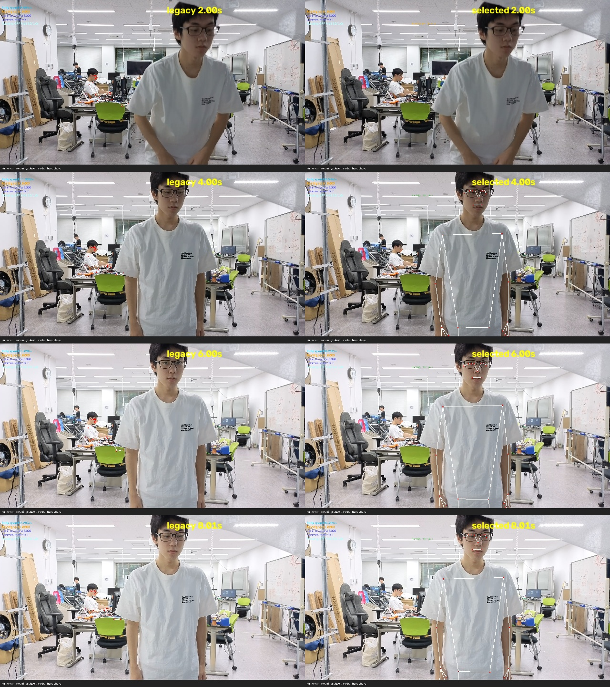

# 背景人物を避けた実演者追跡

## 動作

VIDEOモードで標準有効。カメラと動画の両方に適用する。

1. 取得・再取得中だけ、実演エリアの左右の背景を灰色に置換して単一人物の追跡を開始する。
2. 肩・腰のvisibility、胴体中心の位置、肩幅、胴体の高さを確認する。
3. 候補を得た次のフレームから全画面に戻し、0.2秒以上連続して確認できたら所作判定へ渡す。
4. 選んだ人物の胴体中心と大きさが連続していることを確認する。腕は選択エリアの外まで推定する。
5. 見失ったフレームは即座に未検出を渡し、認識状態・表示履歴をリセットする。
   最後の位置との対応を0.5秒保持した後、新しい候補の取得へ戻る。

取得用の加工画像の座標は表示・所作判定には使わない。
画像サイズ・座標系を変更せず、追跡中は背景も含む全画面を入力する。
未知の動きが入る0.5秒超の処理間隔では取得確認からやり直す。
外部の `current.tracking` も未検出時には `false` となり、取得中に所作イベントを出さない。

画面には胴体中心を置く領域と、待機・取得確認・追跡・追跡喪失の状態を表示する。
枠は腕の可動範囲ではない。

## 設定

`.env` の例（座標は入力画像基準。左上0,0、右下1,1）：

```dotenv
POSE_SELECT_SUBJECT=true
SUBJECT_AREA=0.35,0.15,0.75,0.90
SUBJECT_MIN_TORSO_HEIGHT=0.18
SUBJECT_MIN_SHOULDER_WIDTH=0.10
```

`SUBJECT_AREA` は胴体中心に適用する左・上・右・下。
高さは肩中心から腰中心までの縦方向差 / 画像高さ、肩幅は横方向差 / 画像幅。
カメラの距離や画角が変わると調整が必要。
`POSE_SELECT_SUBJECT=false` で従来の全画面単一人物追跡へ戻せる。
独立した静止画の評価に使うIMAGEモードには適用しない。
新しいモデルや依存パッケージは追加していない。

## 検証結果

明るい幕なし4本と明るい幕越し12本で評価した。

幕なしの比較画像（左: 従来、右: 今回）：



従来の夕涼みは背景の着席人物を追跡し続けたが、今回の処理では入場後に実演者へ骨格が付く。
比較動画は `shared/results/subject-selection/` の各MP4。

幕なし4本の全1,240フレームで、従来は設定した実演条件を外れる骨格が722フレーム出力された。
今回の出力では0フレーム。これは選択条件の検査であり、人物IDの手動正解に対する精度ではない。
同じエリア・同じ大きさの別人を区別できることを示す指標ではない。
処理時間中央値は今回の環境で約28〜34 ms/フレーム（比較評価と他の評価を並行実行した参考値）。

| 幕越しの指標 | 従来 | 今回 |
| --- | ---: | ---: |
| 人物あり注釈で姿勢取得 | 57/67 (85.1%) | 46/67 (68.7%) |
| 人物なし注釈で姿勢出力 | 1/29 (3.4%) | 0/29 (0%) |
| PCK@0.2、未検出を含む | 283/385 (73.5%) | 241/385 (62.6%) |
| 扇ぎの正解区間で検出した動画 | 3/3 | 3/3 |
| 打ち水の正解区間で検出した動画 | 3/3 | 3/3 |

背景出力を抑える代わりに、取得確認や身体の位置・大きさの条件による取りこぼしが増えた。
関節精度全体が改善したとは言えない。扇ぎの動作区間の姿勢取得率は100%→96.3%、
打ち水は100%を維持した。
ラムネ2・3本目の姿勢取得問題、およびラムネ・夕涼みの判定問題は残る。
打ち水動画の区間外出力率は16.1%→19.2%であり、全体の所作誤発火が減ったとも言えない。

## 制約と実機確認

人物の外見や個人IDを識別する仕組みではなく、単一人物の姿勢追跡に位置・大きさの条件を加えた方式。
同じ実演エリアへ別人が重なる場合や、同程度の大きさの人が入れ替わる場合は完全には区別できない。
カメラが遠い・人物が小さい・深く屈む場合にも未検出になり得る。

実機では、背景に人がいる状態で入場・扇ぎ・打ち水・退場・再入場を行い、
待機中に背景人物へ骨格が付かず、追跡中は枠外の手も表示され、退場時に消えることを確認する。
録画での再処理と比較画像の確認は実施済み。実機カメラの操作確認は未実施。
ラムネ・夕涼みの閾値は変更していない。

## 再現とテスト

```bash
uv sync
uv run python -m scripts.evaluate_subject_selection \
  --videos shared/videos/bright-without-the-screen \
  --output docs/subject-selection-controls.json \
  --previews shared/results/subject-selection
uv run python -m scripts.evaluate_action_intervals \
  --environment bright --sample-fps 30 --output docs/subject-bright-actions.json
uv run python -m scripts.evaluate_bright_tracking \
  --annotations shared/annotations/bright-behind-the-screen \
  --videos shared/videos/bright-behind-the-screen \
  --output docs/subject-bright-tracking.json \
  --preview shared/results/subject-bright-ramune.mp4
```

全298テスト、Ruff、Pyright、構文チェックを通過。
背景のみ・候補順序変更・枠外の手・追跡喪失・再取得・時刻不連続・低visibility・
取得フレームの非出力と次フレームの全画面復帰をテストした。

生データ: [幕なし比較](subject-selection-controls.json)、[幕越し動作](subject-bright-actions.json)、
[幕越し注釈](subject-bright-tracking.json)、[幕なし所作](subject-without-actions.json)。
